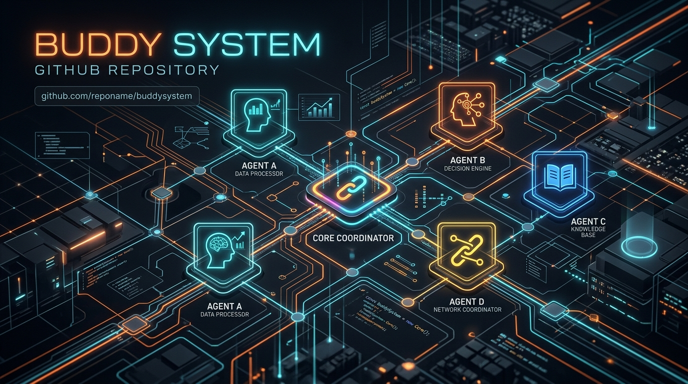

# Buddy System



**Buddy System** is a lightweight coordination pattern and Python CLI for running multiple local AI harnesses as a collaborative crew rather than a pile of disconnected chats.

Instead of trying to force everything into one overloaded context window, or letting multiple agents make overlapping modifications blindly, the Buddy System coordinates agents through a shared memory spine, explicit task claims, and a log sync pipeline.

## Status

This repository is an early open-source seed.

- the core coordination pattern is real and already in use
- the CLI and sync bridge are working prototypes
- the write path is still experimental and should be treated with care
- configuration is local-first and meant to be adapted to your own environment

---

## 🏗️ The Coordination Pattern

The Buddy System consists of six pillars:

1. **Shared Memory Spine:** A canonical JSON file (`memory.json`) and project folder mapping active rules, tech stack details, and paths.
2. **Role Separation:** Different agent harnesses (e.g. Gemini, Codex, local shells) own distinct lanes rather than duplicating effort.
3. **Task Claims:** A markdown board (`Agent Coordination Board.md`) where agents programmatically claim tasks before starting work to avoid file collisions.
4. **Handoff Log:** An append-only markdown journal (`Agent Handoff Log.md`) where agents record what changed, what was verified, and what the next step is before exiting.
5. **Sync Bridge:** A CLI pipeline that parses agent session transcripts, extracts metadata tags (like `[rule]` or `[project]`), and reconciles them back to canonical memory.
6. **Operator Surface:** A cockpit or terminal dashboard showing active claims, memory status, and recent handoffs.

---

## What You Get

- a shared-memory coordination pattern for multiple AI harnesses
- a small Python CLI for claims, handoffs, project metadata, and transcript sync
- a human-readable Markdown control surface for boards and logs
- an implementation reference you can adapt to your own local setup

## CLI Commands

Once installed, the `buddy` command manages your local coordination loop:

### ⚙️ Configuration & Status
* **`buddy init [--vault-path PATH]`**: Initialize a configuration file with default settings and targets.
* **`buddy status`**: Renders a formatted overview of active projects, rule constraints, technical stacks, and log files.

### 🔄 Sync Loop
* **`buddy sync [--conv-id ID] [--summary TEXT] [--next-steps TEXT]`**: Automatically scans agent transcript logs, updates your memory JSON, updates Obsidian project matrix tables, and appends session details to your work journal.

### 📋 Coordination Board & Claims
* **`buddy claim <task_id> [--owner OWNER] [--task TEXT] [--scope SCOPE]`**: Claims a task from the Queue and moves it into the Active Claims section with a started timestamp.
* **`buddy release <task_id> [--status done|ready|blocked]`**: Marks a claimed task as done (appends to completed list), blocked, or returns it to the Queue.

### 📝 Handoff Logging
* **`buddy handoff "<summary>" [--owner OWNER] [--task-id ID] [--next NEXT] [--changed FILES] [--decisions DECISIONS]`**: Automatically formats and prepends an entry to your handoff log under today's date heading.

---

## Installation & Setup

### 1. Requirements
* Python 3.8+ (No external dependencies required, uses standard libraries).

### 2. Install
Clone the repository and install the command:
```bash
git clone https://github.com/yourusername/buddy-system.git
cd buddy-system
pip install --user -e .
```

### 3. Configure
Create a configuration file in your home directory at `~/.config/buddy/config.json` or place a `.buddy.json` in your project root. A starter example is included at [`buddy.example.json`](./buddy.example.json).

Example:

```json
{
  "memory_file": "~/.config/buddy/memory.json",
  "journal_file": "~/.local/state/buddy/journal.md",
  "status_file": "~/.local/state/buddy/status.json",
  "vault_path": "~/BuddyVault",
  "brain_dirs": [
    "~/.gemini/antigravity-cli/brain",
    "~/.gemini/antigravity/brain"
  ],
  "codex_sessions_root": "~/.codex/sessions",
  "opencode_db": "~/.local/share/opencode/opencode.db"
}
```

### 4. Create Vault Surfaces
Ensure your markdown dashboard directories contain the required heading files:
* **Agent Coordination Board:** A file containing `## Active Claims`, `## Queue`, `## Blocked`, and `## Done` headings.
* **Agent Handoff Log:** A file containing `## Rules` and date headings.

---

## Safety Notes

- `buddy sync` updates configured canonical files directly.
- treat the current write path as operator tooling, not unattended infrastructure
- review config carefully before pointing it at real journals, vaults, or shared memory files
- prefer backups, version control, and staged rollout before using it on critical project memory

## Design Principles

* **Human-Readable Memory:** Canonical memory is saved in Markdown and JSON. You can read, edit, or recover it using standard text editors.
* **Preserve Intent:** Memory updates are derived from explicit tags in conversation transcripts, preserving the operator's context.
* **Verification First:** Handoff entries mandate verification details, forcing models to document how they tested their output before passing the baton.
* **Modular Extensions:** Connect new local agent systems by writing short transcript-parsing adapters in `buddy/sync.py`.

## Documentation

* **[Operating Doctrine](./docs/operating-doctrine.md)**: Rules and expected behaviors for agents participating in the coordination loop.
* **[Roles and Surfaces](./docs/roles-and-surfaces.md)**: Explains the breakdown of agent lanes and operating cockpits.
* **[Local Architecture Setup](./docs/local-architecture.md)**: Example local wiring for a Buddy System install.
* **[Open Questions](./docs/open-questions.md)**: Conceptual topics and areas of active research.
* **[Contributing](./CONTRIBUTING.md)**: Contribution posture for this early-stage repo.
* **[Security](./SECURITY.md)**: Known risks and responsible use guidance.
